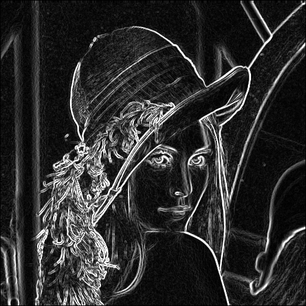

# Edge Detection Backend in C#

[](https://shields.io/)

- [Project Overview](#project-overview)
- [Project Structure](#project-structure)
- [Getting Started](#getting-started)
  - [Prerequisites](#prerequisites)
  - [Installation (with Docker) - Recommended](#installation-with-docker---recommended)
  - [Installation (without Docker)](#installation-without-docker)
  - [Running the Application](#running-the-application)
  - [Testing and Generating Code Coverage](#testing-and-generating-code-coverage)
- [Usage](#usage)
- [Example](#example)
- [Test Results](#test-results)
- [References](#references)

## Project Overview
This project implements image edge detection using either the Sobel or Prewitt operator for processing grayscale images. The application is designed to be modular, allowing for easy extension and maintenance.

## Project Structure
```
EdgeDetection
├── src
│   ├── EdgeDetection
│   │   ├── EdgeDetection.csproj
│   │   ├── Program.cs
│   │   ├── Services
│   │   │   ├── EdgeDetectionService.cs
│   │   │   ├── IEdgeDetectionService.cs
│   │   │   └── IEdgeOperator.cs
│   │   └── Operators
│   │       ├── PrewittOperator.cs
│   │       └── SobelOperator.cs
├── UML
│   ├── class_diagram.puml
│   └── class_diagram.png
├── images
│   ├── sample-input.png
│   ├── sample-prewitt.bmp
│   └── sample-sobel.bmp
├── .gitignore
├── README.md
└── EdgeDetection.sln
```

## Getting Started

### Prerequisites
- .NET SDK (version 6.0 or later)
- Docker (for containerization)

### Installation (with Docker) - Recommended
1. Clone the repository:
   ```
   git clone https://github.com/NelsenEW/EdgeDetection.git
   ```
2. Navigate to the project directory:
   ```
   cd EdgeDetection
   ```
3. Build the Docker image:
   ```
   docker build -t edgedetection .
   ```
4. Run the Docker container:
   ```
   docker run -it --rm -v $(pwd)/images:/app/images edgedetection <imagePath> [operator] [outputPath]
   ```
Replace `<imagePath>` with the path to the input image inside the `images` directory. Optionally, specify `[operator]` (either `Sobel` or `Prewitt`) and `[outputPath]` for the output image. If `[operator]` is not specified, `Sobel` will be used by default. If `[outputPath]` is not specified, the output will be saved with a suffix `-operator_name` in the same directory as the input image.

Example:
`docker run -it --rm --privileged -v $(pwd)/images:/app/images edgedetection /app/images/sample-input.png Prewitt`

### Installation (without Docker)
1. Clone the repository:
   ```
   git clone https://github.com/NelsenEW/EdgeDetection.git
   ```
2. Navigate to the project directory:
   ```
   cd EdgeDetection
   ```
3. Restore the dependencies:
   ```
   dotnet restore
   ```

### Running the Application
To run the application, execute the following command in the terminal:
```
dotnet run --project src/EdgeDetection/EdgeDetection.csproj <operator> <imagePath>
```
Replace `<operator>` with either `Sobel` or `Prewitt` and `<imagePath>` with the path to the input image.

### Testing and Generating Code Coverage
To run the unit tests and generate code coverage reports, use the following command:
```
dotnet test tests/EdgeDetection.Tests/EdgeDetection.Tests.csproj 
/p:CoverletOutputFormat=cobertura --results-directory /app/test_results --logger "trx;LogFileName=test_results.trx" --collect "XPlat Code Coverage" && reportgenerator -reports:/app/test_results/**/coverage.cobertura.xml -targetdir:/app/test_results/coverage_report -reporttypes:Html
```

#### With Docker
1. Build the Docker image with the test stage:
   ```
   docker build -t edgedetection-test --target test .
   ```
2. Run the Docker container and mount volumes to access the test results and code coverage reports:
   ```
   docker run --rm -v $(pwd)/test_results:/app/test_results -v $(pwd)/coverage:/app/coverage edgedetection-test
   ```
3. The test results and code coverage reports will be available in the `test_results` and `coverage` directories on your host machine.

## Example
Here is an example of an input image and the resulting edge-detected output:

### Input Image


### Output Image

#### Sobel


#### Prewitt


## Test Results
The test results and code coverage reports are generated using xunit and cobertura. You can view the detailed test results and coverage analysis in the `test_results` directory.

### View Result
- [Test Result](test_results/test_results.trx)
- [Code Coverage](test_results/index.html)

## References
- [Sobel Operator](https://en.wikipedia.org/wiki/Sobel_operator)
- [Prewitt Operator](https://en.wikipedia.org/wiki/Prewitt_operator)
- [Act Arrange Assert](https://docs.telerik.com/devtools/justmock/basic-usage/arrange-act-assert)